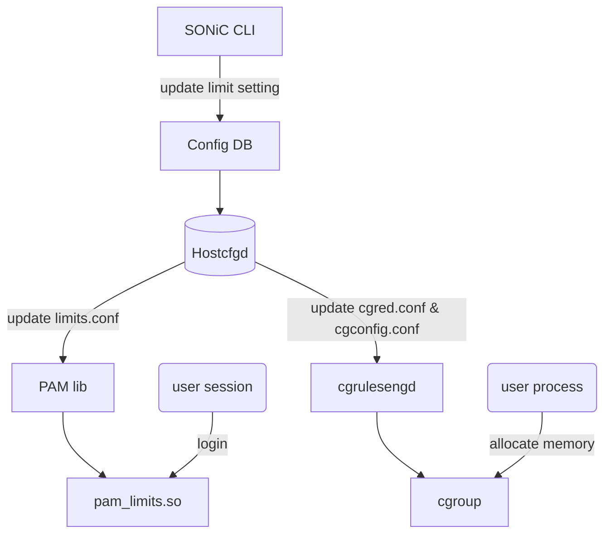

# SONiC Limit user session and memory

# Table of Contents
- [Table of Contents](#table-of-contents)
- [About this Manual](#about-this-manual)
- [1 Functional Requirements](#1-functional-requirement)
  * [1.1 Limit the number of logins per user/group/system](#11-limit-the-number-of-logins-per-user/group/system)
  * [1.2 Limit memory usage per user/group/system](#12-limit-memory-usage-per-user/group/system)
- [2 Configuration and Management Requirements](#2-configuration-and-management-requirements)
  * [2.1 SONiC CLI](#21-sonic-cli)
  * [2.2 Config DB](#22-config-db)
- [3 Design](#design)
  * [3.1 Login Limit Implementation](#31-login-limit-implementation)
  * [3.2 Memory Limit Implementation](#32-memory-limit-implementation)
- [4 Error handling](#error-handling)
- [5 Serviceability and Debug](#serviceability-and-debug)
- [6 Unit Test](#unit-test)
- [8 References](#references)


# About this Manual
This document provides a detailed description on the new features for:
 - Limit the number of logins per user/group/system.
 - Limit memory usage per user/group/system.

# 1 Functional Requirement
## 1.1 Limit the number of logins per user/group/system
 - Can set max login session count per user/group/system.
 - When exceed maximum login count, login failed with error message.

## 1.2 Limit memory usage per user/group/system
 - Can set max memory usage per user/group/system.
 - When exceed maximum memory usage, the OOM process will be paused or terminated.

# 2 Configuration and Management Requirements
## 2.1 SONiC CLI
 - Manage limit
```
    config limit {login | memory} { add | del } {user | group | global} <number>
```

 - Show limit
```
    show limit {login | memory}
```

## 2.2 Config DB
 - Login limit and memory limit are fully configurable by config DB.

# 3 Design
 - Design diagram:



## 3.1 Login limit Implementation
 - Enable PAM plugin pam_limits.so to support login limit.

## 3.2 Memory limit Implementation
 - Use cgroup-tools to support memory limit.
 - cgrulesengd will run in background to migrate process to cgroup.

# 4 Error handling

# 5 Serviceability and Debug

# 6 Unit Test

# 7 References