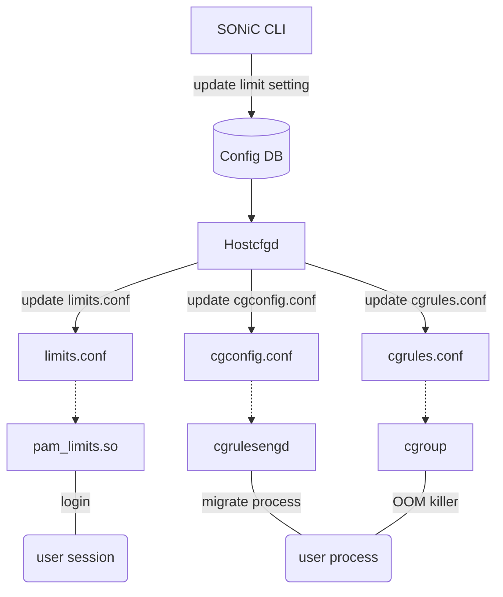
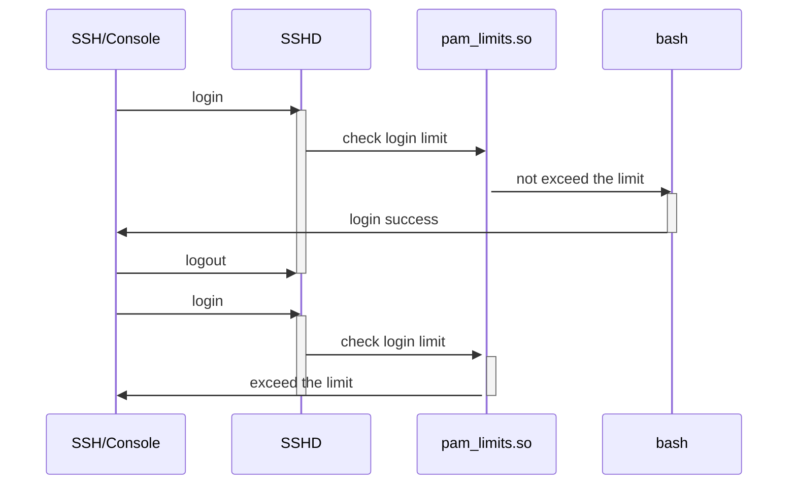
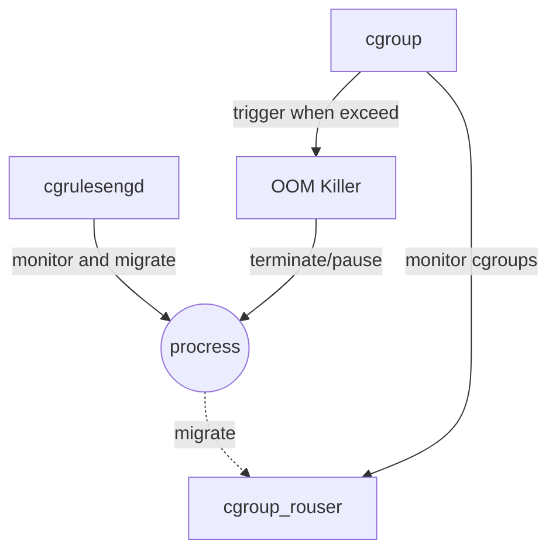

# SONiC Limit user session and memory

# Table of Contents
- [Table of Contents](#table-of-contents)
- [About this Manual](#about-this-manual)
- [1 Functional Requirements](#1-functional-requirement)
  * [1.1 Limit the number of logins per user/group/system](#11-limit-the-number-of-logins-per-user/group/system)
  * [1.2 Limit memory usage per user/group/system](#12-limit-memory-usage-per-user/group/system)
- [2 Configuration and Management Requirements](#2-configuration-and-management-requirements)
  * [2.1 SONiC CLI](#21-sonic-cli)
  * [2.2 Config DB](#22-config-db)
- [3 Design](#design)
  * [3.1 Login Limit Implementation](#31-login-limit-implementation)
  * [3.2 Memory Limit Implementation](#32-memory-limit-implementation)
  * [3.3 ConfigDB Schema](#33-configdb-schema)
  * [3.4 CLI](#34-cli)
- [4 Error handling](#error-handling)
- [5 Serviceability and Debug](#serviceability-and-debug)
- [6 Unit Test](#unit-test)
- [8 References](#references)


# About this Manual
This document provides a detailed description on the new features for:
 - Limit the number of logins per user/group/system.
 - Limit memory usage per user/group/system.

# 1 Functional Requirement
## 1.1 Limit the number of logins per user/group/system
 - Can set max login session count per user/group/system.
 - When exceed maximum login count, login failed with error message.

## 1.2 Limit memory usage per user/group/system
 - Can set max memory usage per user/group/system.
 - When exceed maximum memory usage, the OOM process will be paused or terminated.

# 2 Configuration and Management Requirements
## 2.1 SONiC CLI
 - Manage limit
```
    config limit {login | memory} { add | del } {user | group | global} <name> <number>
```

 - Show limit
```
    show limit {login | memory}
```

## 2.2 Config DB
 - Login limit and memory limit are fully configurable by config DB.

# 3 Design
 - Design diagram:



## 3.1 Login limit Implementation
 - Enable PAM plugin pam_limits.so to support login limit.
 - When login limit exceed, pam_limits.so will terminate login session with error message.



## 3.2 Memory limit Implementation
 - Use cgroup-tools to support memory limit.
 - cgrulesengd will run in background to migrate process to cgroup.
 - cgroup will monitor cgroups resource usage, and trigger OOM killer when exceeds limit.
 - OOM killer will terminate/pause procress.


## 3.2 ConfigDB Schema
 - Limit setting table.
```
; Key
limit_key              = 1*32VCHAR          ; setting name, format is resource type + limit scope + limit name
; Attributes
resource_type                = LIST(1*32VCHAR)   ; Limit resource type, now only support (login, memory)
scope                = LIST(1*32VCHAR)   ; Limit scope, now only support (global, group, user)
value             = Number  ; limit value, for login this is max login session count, for memory this is memory side in byte.
```

## 3.2 CLI
 - Add following command to set/remove limit setting.
```
    // set global login limit
    config limit login add global <max session count>

    // remove global login limit
    config limit login del global

    // add group login limit
    config limit login add group <group name> <max session count>

    // remove group login limit
    config limit login del group <group name>

    // add user login limit
    config limit login add user <user name> <max session count>

    // remove user login limit
    config limit login del user <user name>


    // set global memory limit
    config limit memory add global <memory side in byte>

    // remove global memory limit
    config limit memory del global

    // add group memory limit
    config limit memory add group <group name> <memory side in byte>

    // remove group memory limit
    config limit memory del group <group name>

    // add user memory limit
    config limit memory add user <user name> <memory side in byte>

    // remove user memory limit
    config limit memory del user <user name>
```

 - Add following command to show limit setting.
```
    // show login limit setting
    show limit login

    // show memory limit setting
    show limit memory
```

# 4 Error handling
 - pam_limits.so will return errors as per [PAM](#pam) respectively.

# 5 Serviceability and Debug
 - pam_limits.so can be debugged by enabling the debug flag in PAM config file.
 - cgroup cgrulesengd can be debugged by enabling the CGROUP_LOGLEVEL environment variable.

# 6 Unit Test

- TODO: add end to end test case.

# 7 References
## pam_limits.so
https://man7.org/linux/man-pages/man8/pam_limits.8.html
## cgroup
https://man7.org/linux/man-pages/man7/cgroups.7.html
## cgroup-tools
https://manpages.debian.org/testing/cgroup-tools/cgrules.conf.5.en.html
https://manpages.debian.org/bullseye/cgroup-tools/cgconfig.conf.5.en.html
https://manpages.debian.org/experimental/cgroup-tools/cgrulesengd.8.en.html